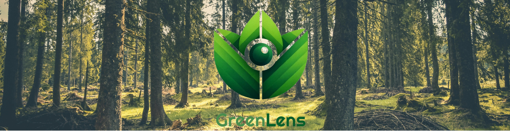

<!-- Improved compatibility of back to top link: See: https://github.com/othneildrew/Best-README-Template/pull/73 -->
<a name="readme-top"></a>


<!-- PROJECT SHIELDS -->
<!--
*** I'm using markdown "reference style" links for readability.
*** Reference links are enbaclosed in brackets [ ] instead of parentheses ( ).
*** See the bottom of this document for the declaration of the reference variables
*** for contributors-url, forks-url, etc. This is an optional, concise syntax you may use.
*** https://www.markdownguide.org/basic-syntax/#reference-style-links
-->
<!--
[![Contributors][contributors-shield]][contributors-url]
[![Forks][forks-shield]][forks-url]
[![Stargazers][stars-shield]][stars-url]
[![Issues][issues-shield]][issues-url]
[![MIT License][license-shield]][license-url]
[![LinkedIn][linkedin-shield]][linkedin-url]
-->

<!-- PROJECT LOGO -->
<br />
<div align="center">
  <a href="https://github.com/FrankFeng-23/GreenLens">
    
  </a>

  <p align="center">
    <h3>An Intuitive App for Accelerating Forest Inventory Mapping :evergreen_tree: </h3>
    <br />
    <a href="https://drive.google.com/drive/folders/17-Yu3KXcgJiFapGc2AjJ2dHNC30YUbup"><strong>Download the APK » </strong> 📱 </a>
    <br />
    <br />
    <a href="manual.md">App Manual :📔</a>
    ·
    <a href="https://www.sciencedirect.com/science/article/pii/S1574954124003169?ssrnid=4786687&dgcid=SSRN_redirect_SD">View Our Paper :bookmark_tabs:</a>
    ·
    <a href="https://github.com/MingyueX/GreenLens/issues">Report Bug :hammer_and_wrench:</a>
    ·
    <a href="https://github.com/MingyueX/GreenLens/issues">Request Feature 🙋</a>
  </p>
</div>


<!-- TABLE OF CONTENTS -->
<details>
  <summary>Table of Contents</summary>
  <ol>
    <li>
      <a href="#about-the-project">About The Project</a>
      <ul>
        <li><a href="#built-with">Built With</a></li>
      </ul>
    </li>
    <li>
      <a href="#getting-started">Getting Started</a>
      <ul>
        <li><a href="#prerequisites">Prerequisites</a></li>
        <li><a href="#installation">Installation</a></li>
      </ul>
    </li>
    <li><a href="#roadmap">Roadmap</a></li>
    <li><a href="#contributing">Contributing</a></li>
    <li><a href="#license">License</a></li>
    <li><a href="#contact">Contact</a></li>
    <li><a href="#citation">Citation</a></li>
  </ol>
</details>


<!-- ABOUT THE PROJECT -->
## About The Project ℹ
<!--
[![Product Name Screen Shot][product-screenshot]](https://example.com)
-->
Forest inventories serve as a foundation for forest planning and management, are key to understanding carbon sequestration dynamics, and are an essential basis for forest ecology research. Such an inventory is, essentially, the recording of certain parameters for each tree in a forest plot; these include location, height, and trunk diameter, typically at breast height (DBH).

An ideal approach to forest inventory should be available worldwide for mass adoption, require minimal capital expenditure and training, rapidly acquire data, and have a low error rate even in challenging field conditions. We believe we have achieved the above goals. Our solution uses ARCore, which is available on a wide variety of low-end smartphones, making it suitable for worldwide mass adoption. The user experience has been carefully designed to require minimal training and allow rapid data acquisition.

<p align="right">(<a href="#readme-top">back to top</a>)</p>


### Built With 🔨

* [![Flutter][flutter-icon]][flutter-url]
* [][arcore-url]
* [![Pytorch][pytorch-icon]][pytorch-url]
* [![OpenCV][opencv-icon]][opencv-url]
* [![Firebase][firebase-icon]][firebase-url]

<p align="right">(<a href="#readme-top">back to top</a>)</p>

### Current Functionality ⚙
* User Registration/Login
* Create/Edit/Manage the Plots
* Create/Edit/Manage Trees in Each Plot
* Record Collection Locations
* Export Data (Tree ID, DBH, Species, Lat, Lon, RGB, Depth, Boundary...)

<!-- GETTING STARTED -->
## Getting Started 🔰

If you would like to try our app, please download our [APK](https://drive.google.com/drive/folders/17-Yu3KXcgJiFapGc2AjJ2dHNC30YUbup) from Google Drive and install it on your Android phone (see [Installation Tutorial](howtoinstall.md)). Before using the app, we strongly recommend checking [Support Device](https://developers.google.com/ar/devices) to ensure device compatibility.

If you are a developer or an ecological researcher interested in understanding how the app operates in depth, you can clone this repository and open it in a IDE like Android Studio. This also allows you to customize some functionalities. However, before doing so, we recommend that you review [our paper](https://www.sciencedirect.com/science/article/pii/S1574954124003169?ssrnid=4786687&dgcid=SSRN_redirect_SD) to understand the app's implementation details, image processing pipeline, and diameter estimation methodology.
### Prerequisites 🔑

We recommend ARCore version >1.18.

### Quick Installation ⚒

* Download the APK and install it on your Android device
* Open the app and wait patiently, the app will automatically download some dependencies, so this may take a while.
* Complete the registration and you're ready to start!

<p align="right">(<a href="#readme-top">back to top</a>)</p>


<!-- USAGE EXAMPLES -->
<!--
## Usage
Use this space to show useful examples of how a project can be used. Additional screenshots, code examples and demos work well in this space. You may also link to more resources.
_For more examples, please refer to the [Documentation](https://example.com)_
<p align="right">(<a href="#readme-top">back to top</a>)</p>
-->

<!-- ROADMAP -->
## Roadmap ✈

- [x] Add map service
- [x] Add boundary adjustment
- [ ] Add user profile
- [ ] Add IOS support
- [ ] Multi-language Support
    - [x] English
    - [ ] Chinese

See the [open issues](https://github.com/MingyueX/GreenLens/issues) for a full list of proposed features (and known issues).

<p align="right">(<a href="#readme-top">back to top</a>)</p>

<!-- CONTRIBUTING -->
## Contributing 💪

Contributions are what make the open source community such an amazing place to learn, inspire, and create. Any contributions you make are **greatly appreciated**.

If you have a suggestion that would make this better, please fork the repo and create a pull request. You can also simply open an issue with the tag "enhancement".
Don't forget to give the project a star! Thanks again!

1. Fork the Project
2. Create your Feature Branch (`git checkout -b feature/AmazingFeature`)
3. Commit your Changes (`git commit -m 'Add some AmazingFeature'`)
4. Push to the Branch (`git push origin feature/AmazingFeature`)
5. Open a Pull Request

<p align="right">(<a href="#readme-top">back to top</a>)</p>


<!-- LICENSE -->
## License 📖

Distributed under the MIT License. See `LICENSE.txt` for more information.

<p align="right">(<a href="#readme-top">back to top</a>)</p>


<!-- CONTACT -->
## Contact 📞

Our Group Link: [Energy and Environment Group](https://www.cst.cam.ac.uk/research/eeg)

<p align="right">(<a href="#readme-top">back to top</a>)</p>


<!-- CITATION -->
## Citation 📚
```
@article{FENG2024102774,
title = {An app for tree trunk diameter estimation from coarse optical depth maps},
journal = {Ecological Informatics},
volume = {82},
pages = {102774},
year = {2024},
issn = {1574-9541},
doi = {https://doi.org/10.1016/j.ecoinf.2024.102774},
author = {Zhengpeng Feng and Mingyue Xie and Amelia Holcomb and Srinivasan Keshav}
}
```


<!-- MARKDOWN LINKS & IMAGES -->
<!-- https://www.markdownguide.org/basic-syntax/#reference-style-links -->
[flutter-icon]: https://img.shields.io/badge/flutter-%23FFFFFF?style=for-the-badge&logo=flutter&logoColor=%2302569B
[flutter-url]: https://flutter.dev/
[arcore-url]: https://developers.google.com/ar
[pytorch-icon]: https://img.shields.io/badge/pytorch-%23FFFFFF?style=for-the-badge&logo=pytorch&logoColor=%23EE4C2C
[pytorch-url]: https://pytorch.org/
[opencv-icon]: https://img.shields.io/badge/opencv-%23FFFFFF?style=for-the-badge&logo=opencv&logoColor=%235C3EE8
[opencv-url]: https://opencv.org/
[firebase-icon]: https://img.shields.io/badge/firebase-%23FFFFFF?style=for-the-badge&logo=firebase&logoColor=%23FFCA28
[firebase-url]: https://firebase.google.com/
