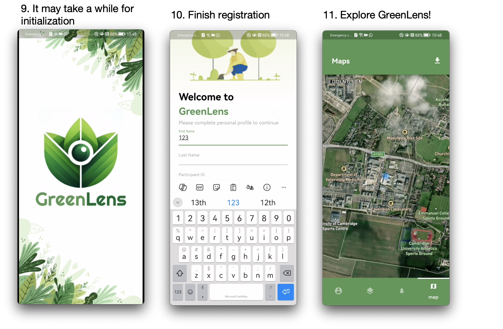

## How to Install the App on Your Android Phone (Using Huawei P30 as an Example)
### Image and Text
* Use your phone's browser to visit our GitHub homepage, long press the APK link, and select "Open in New Tab." (⚠️ Devices with the Google Drive app installed may directly redirect to the Google Drive application when clicking the link, complicating the installation process. Therefore, we strongly recommend opening it in the browser.)
* 
* You should see a single file on the Google Drive webpage. Click on this file and then click "Download." Due to the large file size, your device may warn you about potential risks. As an open-source, free tree diameter measurement software, we assure you that it contains no trojans!
* 
* The file size is approximately 660 MB, so downloading may take some time. Once the download is complete, go to the browser's download management interface and click on the downloaded APK to install it. After installation, open GreenLens app.
* 
* On your first entry, the app will automatically download some dependencies, so please wait for a while. After the app is initialized, complete a simple registration to start exploring GreenLens!
* 

### GIF Demonstration
* 
* 
* 
*  