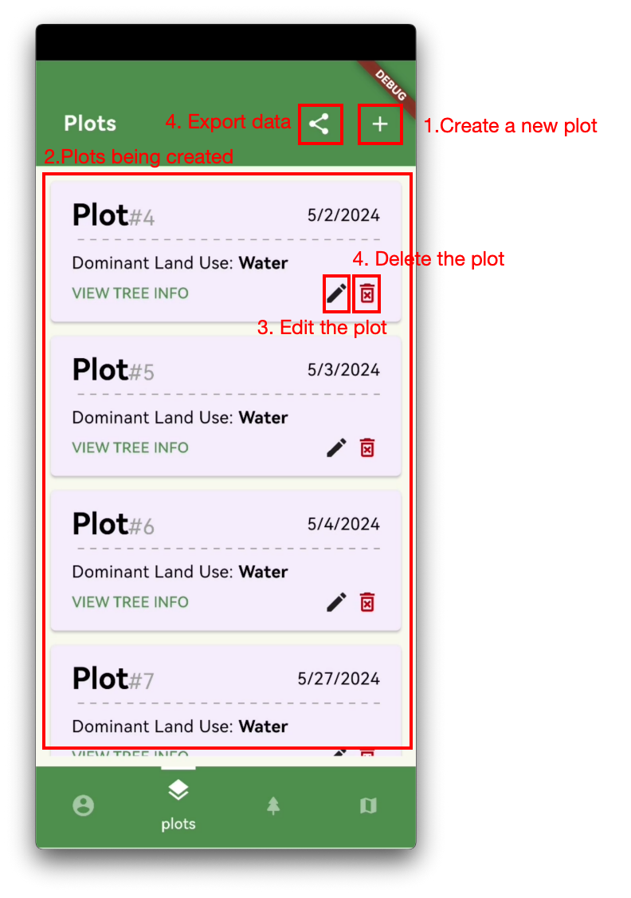
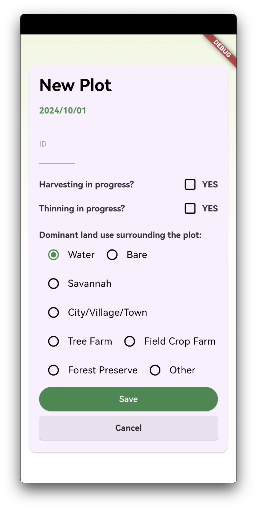
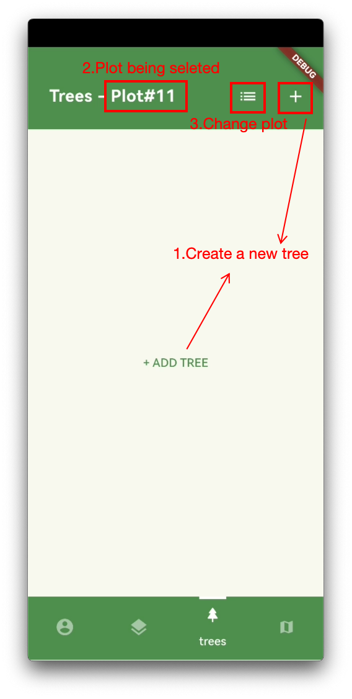
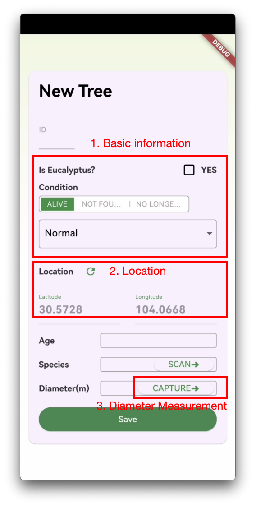
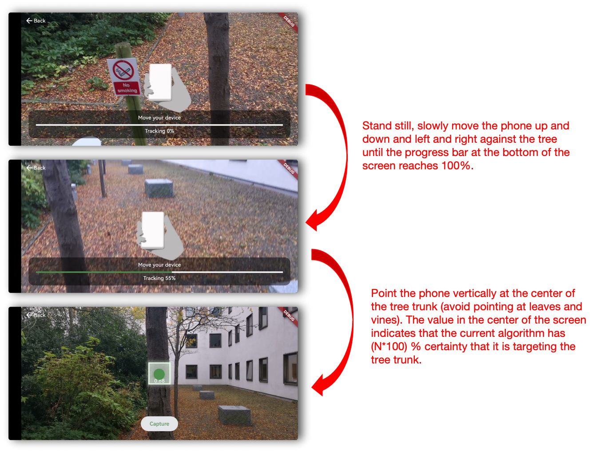
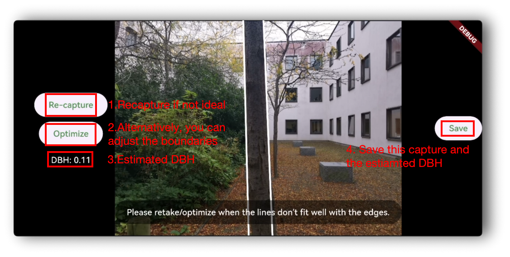
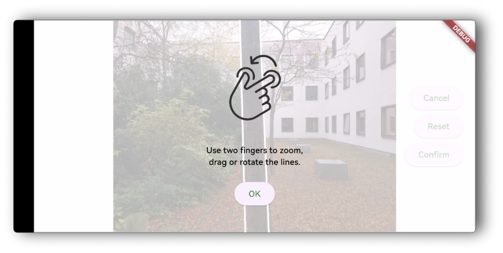
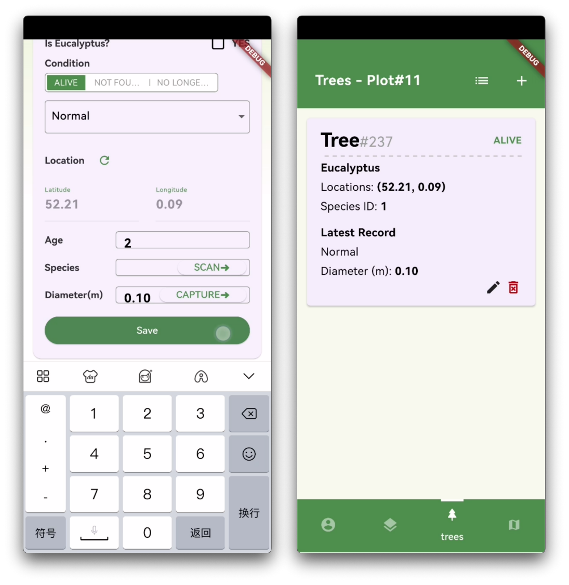

## User Manual

### Creating a Plot
GreenLens supports the creation of multiple plots. The creation and measurement of individual trees will take place within each separate plot. Below is the interface for managing plots:

Click the ➕ in the upper right corner to enter the following page:

Fill in the details according to the actual situation of the plot, and then click save to create your plot.

### Adding Trees to a Plot
After creating a plot, users can add any number of trees within it. Below is the tree management interface after selecting a specific plot:

Click the ➕ in the upper right corner to add a new tree, and you should see the following interface: The app will automatically record the latitude and longitude information of the device when creating this tree. For some other tree information, users need to fill in or select manually.

### Diameter Measurement
Click Capture in the tree creation interface to access the trunk diameter measurement interface (landscape mode is required):

We recommend slowly moving the phone for at least 8 seconds to ensure that the algorithm can fully perceive the depth information of the environment. When Capture is clickable, click Capture; the device will start on-device inference, and after a few seconds, you will arrive at the following interface:

If the fitted boundary is not accurate, you can choose to retake the photo or just adjust the fitted boundary (recommended). When you want to adjust the boundary, select Optimize and jump to the following interface:

Use two fingers to adjust the fitted parallel lines until they closely align with the boundaries of the trunk. After clicking save, you will notice that the calculated DBH will automatically fill in on the tree's information page (left image). After clicking Save, you have created the first tree in this plot (right image).

Go ahead and create more plots and trees!

### Exporting Your Data
Navigate to the plot management interface, where you can find a share button in the upper right corner. The saved data includes: all tree information from all plots (basic information, location, RGB and depth images, fitted boundary lines, DBH, etc.). The data is saved at your_device/com.cleeg.greenlens/app_flutter/GreenLens.